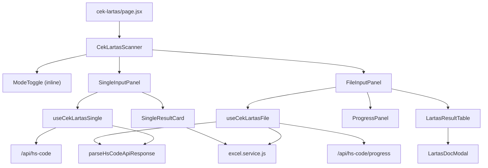

# Dokumen Desain: Refactor Cek Lartas

## Ikhtisar

Dokumen ini mendeskripsikan desain teknis untuk refactor halaman **Cek Lartas** (`/cek-lartas`) di platform Pesisir. Refactor ini memisahkan komponen monolitik `HsCodeScanner.jsx` (~797 baris) menjadi unit-unit yang lebih kecil dengan tanggung jawab tunggal, memindahkan logika bisnis ke custom hooks, dan menambahkan beberapa peningkatan UX.

Tujuan utama:
1. **Rename** — nama komponen disesuaikan dengan konteks fitur Cek Lartas
2. **Separation of concerns** — logika fetch/streaming ke custom hooks, UI ke komponen kecil
3. **UX improvements** — feedback error lebih jelas, progress panel lebih informatif
4. **Fitur tambahan** — copy HS code, export Single ke Excel
5. **Parsing terpusat** — semua data API diparse di satu tempat

Tidak ada perubahan pada fungsionalitas inti, endpoint API, atau logika adaptive chunking yang sudah berjalan.

---

## Arsitektur

### Struktur File Target

```
app/
├── cek-lartas/
│   └── page.jsx                          # update: CekLartasPage, import CekLartasScanner
├── presentation/
│   ├── components/
│   │   ├── features/
│   │   │   ├── CekLartasScanner.jsx      # entry point — hanya mode toggle + delegasi
│   │   │   ├── LartasResultTable.jsx     # rename dari HsCodeTable.jsx
│   │   │   └── cek-lartas/              # subfolder sub-komponen
│   │   │       ├── SingleInputPanel.jsx
│   │   │       ├── FileInputPanel.jsx
│   │   │       ├── SingleResultCard.jsx
│   │   │       ├── ProgressPanel.jsx
│   │   │       └── LartasDocModal.jsx
│   │   └── index.js                     # update exports
│   └── hooks/
│       ├── useCekLartasSingle.js        # baru — logika fetch mode Single
│       └── useCekLartasFile.js          # baru — logika streaming mode File
└── adapters/
    └── presenters/
        └── hs-code.presenter.js         # tambah parseHsCodeApiResponse
```

### Diagram Alur Data



### Alur Dependency

```
page.jsx
  └── CekLartasScanner (presentation/components/features)
        ├── SingleInputPanel (cek-lartas/)
        │     ├── useCekLartasSingle (presentation/hooks)
        │     │     └── parseHsCodeApiResponse (adapters/presenters)
        │     └── SingleResultCard (cek-lartas/)
        │           └── downloadAsExcel (infrastructure/excel)
        └── FileInputPanel (cek-lartas/)
              ├── useCekLartasFile (presentation/hooks)
              │     ├── parseHsCodeApiResponse (adapters/presenters)
              │     └── downloadAsExcel (infrastructure/excel)
              ├── ProgressPanel (cek-lartas/)
              └── LartasResultTable (presentation/components/features)
                    └── LartasDocModal (cek-lartas/)
```

---

## Komponen dan Antarmuka

### 1. Data Shapes

Semua `@typedef` didefinisikan di sini sebelum function contracts.

```js
/**
 * @typedef {"single" | "file"} ScannerMode
 * Mode aktif pada CekLartasScanner.
 * "single" = input satu HS code, "file" = upload Excel banyak HS code.
 */

/**
 * @typedef {"idle" | "loading" | "success" | "error" | "partial"} FetchStatus
 * Status proses fetch/streaming.
 * - "idle"    : belum ada aksi
 * - "loading" : sedang memproses
 * - "success" : selesai tanpa error
 * - "error"   : gagal total
 * - "partial" : selesai sebagian (streaming berhenti di tengah)
 *
 * Kombinasi tidak valid: "partial" hanya mungkin di mode File.
 */

/**
 * @typedef {Object} LartasDetail
 * Satu entri regulasi LARTAS dari API INSW.
 * @property {string | null} namaIzin       - Nama izin/regulasi
 * @property {string | null} noSkep         - Nomor SKEP regulasi
 * @property {string | null} idDokumen      - ID dokumen pabean
 * @property {string[] | null} dokumenPabean - Kode dokumen pabean terkait (misal: ["20", "40"])
 * @property {string | null} tanggalMulai   - Tanggal mulai berlaku (ISO string)
 * @property {string | null} tanggalAkhir   - Tanggal akhir berlaku (ISO string)
 * @property {string[] | null} links        - URL PDF regulasi (prioritas utama)
 * @property {string | null} link           - URL PDF tunggal (fallback)
 * @property {string} [category]            - Kategori LARTAS, diisi saat diproses (bukan dari API langsung)
 */

/**
 * @typedef {Object} LartasResult
 * Hasil satu HS code dari API, setelah diparse oleh parseHsCodeApiResponse.
 * @property {string} hsCode                        - HS code 8 digit
 * @property {string | null} bm                     - Bea Masuk
 * @property {string | null} ppn                    - PPN
 * @property {string | null} pph                    - PPH
 * @property {string | null} pphNonApi              - PPH Non-API
 * @property {boolean} hasLartasImport              - Ada LARTAS impor
 * @property {boolean} hasLartasBorder              - Ada LARTAS border
 * @property {boolean} hasLartasPostBorder          - Ada LARTAS post-border
 * @property {boolean} hasLartasExport              - Ada LARTAS ekspor
 * @property {LartasDetail[]} lartasImportDetails   - Detail LARTAS impor
 * @property {LartasDetail[]} lartasBorderDetails   - Detail LARTAS border
 * @property {LartasDetail[]} lartasPostBorderDetails - Detail LARTAS post-border
 * @property {LartasDetail[]} lartasExportDetails   - Detail LARTAS ekspor
 */

/**
 * @typedef {{ ok: true, data: LartasResult } | { ok: false, error: string }} ParseResult
 * Hasil parsing respons API. Selalu salah satu dari dua bentuk ini.
 * Tidak pernah throw — error dikembalikan sebagai nilai.
 */

/**
 * @typedef {Object} ProgressState
 * State progres streaming mode File.
 * @property {number} total                         - Total HS code yang akan diproses
 * @property {number} current                       - Jumlah HS code yang sudah selesai
 * @property {string | null} currentCode            - HS code yang sedang diproses
 * @property {"fetched" | "cached" | "invalid" | "error" | null} currentMode - Status kode aktif
 * @property {string[]} logs                        - Log aktivitas (maks 10 entri terakhir)
 * @property {number} chunkSize                     - Ukuran chunk aktif saat ini
 * @property {number} baseChunkSize                 - Ukuran chunk maksimum (dari env)
 * @property {number | null} startedAt              - Timestamp mulai (ms epoch)
 * @property {number | null} finishedAt             - Timestamp selesai (ms epoch), null saat berjalan
 * @property {number} elapsedMs                     - Durasi berjalan dalam ms
 * @property {number | null} etaRemainingMs         - Estimasi sisa waktu dalam ms
 * @property {number | null} etaTotalMs             - Estimasi total durasi dalam ms
 * @property {number | null} etaTotalMsBeforeComplete - ETA terakhir sebelum selesai (untuk delta)
 * @property {number | null} actualDurationMs       - Durasi aktual setelah selesai
 * @property {number | null} etaReferenceMs         - ETA referensi untuk kalkulasi delta
 * @property {number | null} etaDeltaMs             - Selisih aktual vs ETA (positif = lebih lama)
 *
 * Invariant: current <= total selalu.
 * Invariant: finishedAt hanya diisi setelah proses selesai atau gagal.
 */

/**
 * @typedef {Object} SingleHookReturn
 * Nilai yang dikembalikan oleh useCekLartasSingle.
 * @property {string} singleInput                   - Nilai input HS code saat ini
 * @property {(value: string) => void} setSingleInput - Setter input
 * @property {LartasResult | null} singleResult     - Hasil fetch, null jika belum ada
 * @property {string} singleStatus                  - Pesan status/error untuk ditampilkan
 * @property {boolean} isSingleLoading              - true saat fetch sedang berjalan
 * @property {() => Promise<void>} handleFetch      - Trigger fetch ke /api/hs-code
 * @property {() => Promise<void>} handleCopy       - Salin HS code ke clipboard
 * @property {() => void} handleExportSingle        - Export hasil ke Excel
 */

/**
 * @typedef {Object} FileHookReturn
 * Nilai yang dikembalikan oleh useCekLartasFile.
 * @property {Array<Array> | null} fileData         - Data 2D dari file Excel, null jika belum upload
 * @property {LartasResult[] | null} resultData     - Hasil streaming, null jika belum fetch
 * @property {string} status                        - Pesan status/error untuk ditampilkan
 * @property {boolean} isLoading                    - true saat streaming sedang berjalan
 * @property {ProgressState} progress               - State progres streaming
 * @property {(e: Event) => Promise<void>} handleFileChange - Handler upload file
 * @property {() => Promise<void>} handleFetch      - Trigger streaming ke /api/hs-code/progress
 * @property {() => void} handleExportResult        - Export resultData ke Excel
 */

/**
 * @typedef {Object} ExcelSingleRow
 * Satu baris di file Excel export mode Single.
 * @property {string} "HS Code"         - HS code 8 digit
 * @property {string} "Kategori LARTAS" - "Impor Border" | "Impor Post Border" | "Ekspor Border" | "Tidak Ada"
 * @property {string} "Nama Izin"       - Nama izin regulasi
 * @property {string} "No SKEP"         - Nomor SKEP
 * @property {string} "ID Dokumen"      - ID dokumen pabean
 * @property {string} "Dokumen Pabean"  - Kode dokumen pabean, dipisah koma
 * @property {string} "Tanggal Mulai"   - Tanggal mulai berlaku
 * @property {string} "Tanggal Akhir"   - Tanggal akhir berlaku
 */
```

---
### 2. Function Contracts

#### `parseHsCodeApiResponse` — `app/adapters/presenters/hs-code.presenter.js`

```js
/**
 * Mem-parse satu objek respons mentah dari API /api/hs-code atau stream /api/hs-code/progress
 * menjadi LartasResult yang tervalidasi.
 * Tidak pernah throw — error dikembalikan sebagai { ok: false, error }.
 *
 * @param {unknown} raw - Objek mentah dari API
 * @returns {ParseResult}
 *
 * @example
 * parseHsCodeApiResponse({ hsCode: "84713090", bm: "0%", hasLartasImport: false, ... })
 * // => { ok: true, data: { hsCode: "84713090", bm: "0%", hasLartasImport: false, lartasImportDetails: [], ... } }
 *
 * @example
 * parseHsCodeApiResponse(null)
 * // => { ok: false, error: "Response tidak valid: bukan objek" }
 *
 * @example
 * parseHsCodeApiResponse({ bm: "5%" })
 * // => { ok: false, error: "Field wajib tidak ada: hsCode" }
 */
export function parseHsCodeApiResponse(raw) { ... }
```

**Wish list helper:**
- `isPlainObject(value)` — cek apakah value adalah plain object (bukan null, array, dll)
- `parseDetailArray(value)` — normalisasi array detail LARTAS, kembalikan `[]` jika bukan array

---

#### `useCekLartasSingle` — `app/presentation/hooks/useCekLartasSingle.js`

```js
/**
 * Custom hook untuk logika fetch mode Single Cek Lartas.
 * Mengelola state input, hasil, status, dan loading.
 * Mengekspos handleFetch, handleCopy, handleExportSingle.
 *
 * @returns {SingleHookReturn}
 *
 * @example
 * // Penggunaan di komponen:
 * const { singleInput, setSingleInput, singleResult, singleStatus, isSingleLoading,
 *         handleFetch, handleCopy, handleExportSingle } = useCekLartasSingle();
 *
 * @example
 * // Setelah handleFetch("84713090") berhasil:
 * // singleResult => { hsCode: "84713090", bm: "0%", ... }
 * // singleStatus => "Data berhasil ditampilkan."
 * // isSingleLoading => false
 */
export function useCekLartasSingle() { ... }
```

**Wish list helper (internal):**
- `fetchSingleHsCode(normalized)` — fetch ke `/api/hs-code`, kembalikan `ParseResult`
- `buildSingleExcelRows(result)` — transform `LartasResult` ke array `ExcelSingleRow`
- `formatSingleExcelFilename(hsCode)` — buat nama file `lartas-{hsCode}-{YYYYMMDD}.xlsx`

---

#### `handleFetch` (dalam `useCekLartasSingle`)

```js
/**
 * Memvalidasi input, fetch ke /api/hs-code, parse respons, update state.
 * Jika input tidak valid: set singleStatus error, tidak fetch.
 * Jika fetch gagal HTTP: set singleStatus dengan kode status.
 * Jika fetch gagal network: set singleStatus dengan pesan koneksi.
 *
 * @returns {Promise<void>}
 *
 * @example
 * // Input "84713090" (valid):
 * // → fetch POST /api/hs-code dengan body [{ hs_code: "84713090" }]
 * // → parse respons[0] via parseHsCodeApiResponse
 * // → setSingleResult(data), setSingleStatus("Data berhasil ditampilkan.")
 *
 * @example
 * // Input "123" (tidak valid):
 * // → setSingleStatus("HS code harus 8 digit angka.")
 * // → tidak ada fetch
 */
async function handleFetch() { ... }
```

---

#### `handleCopy` (dalam `useCekLartasSingle`)

```js
/**
 * Menyalin HS code dari singleResult ke clipboard.
 * Jika Clipboard API tidak tersedia: set singleStatus error.
 * Jika berhasil: set singleStatus konfirmasi selama 2 detik, lalu reset.
 *
 * @returns {Promise<void>}
 *
 * @example
 * // singleResult.hsCode = "84713090", Clipboard API tersedia:
 * // → navigator.clipboard.writeText("84713090")
 * // → setSingleStatus("HS code disalin ke clipboard.")
 * // → setelah 2 detik: setSingleStatus("")
 *
 * @example
 * // navigator.clipboard tidak tersedia:
 * // → setSingleStatus("Salin tidak didukung di browser ini.")
 */
async function handleCopy() { ... }
```

---

#### `handleExportSingle` (dalam `useCekLartasSingle`)

```js
/**
 * Mengekspor singleResult ke file Excel.
 * Jika singleResult null: tidak melakukan aksi.
 * Nama file: lartas-{hsCode}-{YYYYMMDD}.xlsx
 *
 * @returns {void}
 *
 * @example
 * // singleResult = { hsCode: "84713090", lartasBorderDetails: [{ namaIzin: "PI", ... }], ... }
 * // → buildSingleExcelRows(singleResult) menghasilkan array ExcelSingleRow
 * // → downloadAsExcel(rows, "lartas-84713090-20250115.xlsx")
 *
 * @example
 * // singleResult = null:
 * // → tidak ada aksi
 */
function handleExportSingle() { ... }
```

---

#### `buildSingleExcelRows` (helper internal)

```js
/**
 * Mengubah LartasResult menjadi array ExcelSingleRow untuk export.
 * Jika tidak ada detail LARTAS: kembalikan satu baris dengan Kategori "Tidak Ada".
 * Setiap detail dari setiap kategori menjadi satu baris terpisah.
 *
 * @param {LartasResult} result
 * @returns {ExcelSingleRow[]}
 *
 * @example
 * buildSingleExcelRows({
 *   hsCode: "84713090",
 *   lartasBorderDetails: [{ namaIzin: "PI", noSkep: "123", ... }],
 *   lartasPostBorderDetails: [],
 *   lartasExportDetails: [],
 *   ...
 * })
 * // => [{ "HS Code": "84713090", "Kategori LARTAS": "Impor Border", "Nama Izin": "PI", ... }]
 *
 * @example
 * buildSingleExcelRows({ hsCode: "00000000", lartasBorderDetails: [], lartasPostBorderDetails: [], lartasExportDetails: [], ... })
 * // => [{ "HS Code": "00000000", "Kategori LARTAS": "Tidak Ada", "Nama Izin": "-", ... }]
 */
function buildSingleExcelRows(result) { ... }
```

---

#### `useCekLartasFile` — `app/presentation/hooks/useCekLartasFile.js`

```js
/**
 * Custom hook untuk logika streaming mode File Cek Lartas.
 * Mengelola state fileData, resultData, status, isLoading, progress.
 * Mengekspos handleFileChange, handleFetch, handleExportResult.
 * Logika adaptive chunking dipertahankan dari implementasi sebelumnya.
 *
 * @returns {FileHookReturn}
 *
 * @example
 * // Penggunaan di komponen:
 * const { fileData, resultData, status, isLoading, progress,
 *         handleFileChange, handleFetch, handleExportResult } = useCekLartasFile();
 *
 * @example
 * // Setelah handleFetch() selesai dengan 50 HS code:
 * // resultData => [LartasResult, LartasResult, ...] (50 item)
 * // status => "Berhasil! 50 data HS Code ditampilkan."
 * // isLoading => false
 */
export function useCekLartasFile() { ... }
```

**Wish list helper (internal):**
- `createInitialProgressState()` — buat ProgressState awal dengan semua nilai default
- `consumeProgressStream(stream, callbacks)` — baca ReadableStream, parse event JSON, kembalikan `{ data, isPartial, processedCount }`
- `finalizeProgress(prev, startedAt, total, processedGlobal)` — hitung durasi aktual, delta ETA, kembalikan ProgressState final
- `resolveChunkSize(rawValue)` — parse env var chunk size, fallback ke 3
- `sleep(ms)` — Promise delay
- `extractHsCodes(fileData)` — ekstrak HS code valid dari 2D array Excel

---

#### `handleFileChange` (dalam `useCekLartasFile`)

```js
/**
 * Membaca file Excel dari event input, memperbarui fileData.
 * Jika bukan .xls/.xlsx: set status error, tidak update fileData.
 * Jika tidak ada HS code valid: set status error.
 * Jika berhasil: set fileData, reset resultData dan progress.
 *
 * @param {React.ChangeEvent<HTMLInputElement>} e
 * @returns {Promise<void>}
 *
 * @example
 * // File "data.xlsx" berisi HS code valid:
 * // → fileToArrayBuffer(file) → bufferToJson(buffer)
 * // → setFileData(jsonData), setResultData(null), setStatus("")
 *
 * @example
 * // File "data.pdf":
 * // → setStatus("File harus berformat .xls atau .xlsx.")
 * // → fileData tidak berubah
 */
async function handleFileChange(e) { ... }
```

---

#### `handleExportResult` (dalam `useCekLartasFile`)

```js
/**
 * Mengunduh resultData sebagai file Excel.
 * Jika resultData kosong atau null: tidak melakukan aksi.
 * Nama file: lartas-hasil-{YYYYMMDD}.xlsx
 *
 * @returns {void}
 *
 * @example
 * // resultData = [{ hsCode: "84713090", ... }, { hsCode: "12345678", ... }]:
 * // → downloadAsExcel(resultData, "lartas-hasil-20250115.xlsx")
 *
 * @example
 * // resultData = null:
 * // → tidak ada aksi
 */
function handleExportResult() { ... }
```

---

#### `CekLartasScanner` — `app/presentation/components/features/CekLartasScanner.jsx`

```js
/**
 * Komponen utama halaman Cek Lartas.
 * Hanya bertanggung jawab: merender mode toggle dan mendelegasikan ke SingleInputPanel atau FileInputPanel.
 * State mode disimpan di sini; state fetch/file ada di masing-masing hook dalam sub-panel.
 *
 * @returns {JSX.Element}
 *
 * @example
 * // Render awal: mode = "single"
 * // → ModeToggle dengan "Input Tunggal" aktif
 * // → SingleInputPanel dirender
 *
 * @example
 * // Setelah klik "Input File / Banyak HS Code":
 * // → mode = "file"
 * // → FileInputPanel dirender
 */
export default function CekLartasScanner() { ... }
```

---

#### `SingleInputPanel` — `app/presentation/components/features/cek-lartas/SingleInputPanel.jsx`

```js
/**
 * Panel form untuk mode Single Input.
 * Menggunakan useCekLartasSingle untuk semua state dan aksi.
 * Merender: input field, tombol Cari, Alert status, SingleResultCard.
 *
 * @returns {JSX.Element}
 *
 * @example
 * // State awal: singleInput = "", singleResult = null
 * // → input kosong, tombol "Cari HS Code" aktif, tidak ada card
 *
 * @example
 * // Setelah fetch berhasil: singleResult = { hsCode: "84713090", ... }
 * // → Alert variant="success" dengan pesan sukses
 * // → SingleResultCard dirender dengan data hasil
 */
export default function SingleInputPanel() { ... }
```

---

#### `FileInputPanel` — `app/presentation/components/features/cek-lartas/FileInputPanel.jsx`

```js
/**
 * Panel form untuk mode File Input.
 * Menggunakan useCekLartasFile untuk semua state dan aksi.
 * Merender: input file, tombol Tarik Data, tombol Export, Alert status, ProgressPanel, LartasResultTable.
 *
 * @returns {JSX.Element}
 *
 * @example
 * // State awal: fileData = null, resultData = null
 * // → input file kosong, tombol "Tarik Data" disabled
 *
 * @example
 * // Setelah streaming gagal parsial dengan 30 dari 50 data:
 * // → Alert variant="warning": "Proses berhenti. 30 data parsial berhasil ditampilkan."
 * // → LartasResultTable dirender dengan 30 baris
 */
export default function FileInputPanel() { ... }
```

---

#### `SingleResultCard` — `app/presentation/components/features/cek-lartas/SingleResultCard.jsx`

```js
/**
 * Card hasil mode Single — menampilkan tarif dan detail LARTAS satu HS code.
 * Merender: HS code, badge LARTAS, InfoBadge per kategori, LartasSectionCard per detail,
 * tombol "Salin HS Code", tombol "Ekspor ke Excel".
 *
 * @param {{ row: LartasResult, onCopy: () => Promise<void>, onExport: () => void }} props
 * @returns {JSX.Element}
 *
 * @example
 * // row.hasLartasBorder = true, row.lartasBorderDetails = [{ namaIzin: "PI", ... }]
 * // → badge "LARTAS Ada", LartasSectionCard "Impor Border" dengan detail
 * // → tombol "Salin HS Code" dan "Ekspor ke Excel" ditampilkan
 *
 * @example
 * // row.hasLartasImport = false, row.hasLartasBorder = false, row.hasLartasExport = false
 * // → badge "LARTAS Tidak Ada", pesan "Tidak ada detail LARTAS"
 * // → tombol "Ekspor ke Excel" tetap ditampilkan (akan export baris "Tidak Ada")
 */
export default function SingleResultCard({ row, onCopy, onExport }) { ... }
```

---

#### `ProgressPanel` — `app/presentation/components/features/cek-lartas/ProgressPanel.jsx`

```js
/**
 * Panel progres streaming mode File.
 * Merender: progress bar + persentase, "X dari Y HS code", ETA jam, durasi berjalan,
 * ringkasan setelah selesai, log aktivitas scrollable.
 * Komponen murni — tidak ada state internal, hanya menerima props.
 *
 * @param {{ progress: ProgressState, isLoading: boolean }} props
 * @returns {JSX.Element}
 *
 * @example
 * // progress.current = 45, progress.total = 100, isLoading = true
 * // → progress bar 45%, teks "45 dari 100 HS code", ETA ditampilkan
 *
 * @example
 * // progress.current = 100, progress.total = 100, isLoading = false, progress.actualDurationMs = 120000
 * // → progress bar 100%, ringkasan: "Durasi aktual: 02:00", delta ETA ditampilkan
 */
export default function ProgressPanel({ progress, isLoading }) { ... }
```

**Wish list helper (internal, pure functions):**
- `calcPercent(current, total)` — hitung persentase 0-100, aman untuk total = 0
- `formatDuration(ms)` — format ms ke "MM:SS"
- `formatEtaClock(startedAt, etaTotalMs)` — format ETA ke jam lokal "HH:MM:SS"
- `formatDelta(deltaMs)` — format delta ke "+MM:SS" / "-MM:SS" / "tepat sesuai ETA"

---

#### `LartasDocModal` — `app/presentation/components/features/cek-lartas/LartasDocModal.jsx`

```js
/**
 * Modal detail regulasi LARTAS per dokumen pabean.
 * Dipindahkan dari HsCodeTable.jsx ke file terpisah.
 * Merender: header (ref, HS code, kode dok), daftar detail per kategori, link PDF.
 *
 * @param {{ cell: { referenceNo: number, hsCode: string, docCode: string, details: LartasDetail[] }, onClose: () => void }} props
 * @returns {JSX.Element}
 *
 * @example
 * // cell = { referenceNo: 1, hsCode: "84713090", docCode: "20", details: [{ namaIzin: "PI", ... }] }
 * // → modal terbuka dengan header "Ref #1 | HS 8471.30.90", judul "Dokumen Pabean 20"
 * // → detail dikelompokkan per kategori
 *
 * @example
 * // Klik backdrop atau tombol "Tutup":
 * // → onClose() dipanggil
 */
export default function LartasDocModal({ cell, onClose }) { ... }
```

---
## Model Data

### Alur Parsing Data API

Semua data yang masuk dari API INSW diparse di satu titik: `parseHsCodeApiResponse` di `hs-code.presenter.js`. Tidak ada komponen UI atau hook yang mengakses field API secara langsung tanpa melalui parser ini.

```
API Response (raw JSON)
        │
        ▼
parseHsCodeApiResponse(raw)
        │
        ├── { ok: false, error: string }  ──► hook mencatat error, gunakan nilai default aman
        │
        └── { ok: true, data: LartasResult }  ──► disimpan ke state hook
```

### Normalisasi Field

`parseHsCodeApiResponse` menerapkan normalisasi berikut:

| Field API | Tipe Raw | Normalisasi |
|-----------|----------|-------------|
| `hsCode` | string/number | String, wajib ada |
| `bm`, `ppn`, `pph`, `pphNonApi` | string/null | String atau null |
| `hasLartasImport`, dll | boolean/truthy | Boolean eksplisit |
| `lartasImportDetails`, dll | array/null/undefined | Array (default `[]`) |
| Detail item fields | mixed | String atau null per field |

### State Lifecycle `useCekLartasSingle`

```
Initial:
  singleInput = ""
  singleResult = null
  singleStatus = ""
  isSingleLoading = false

handleFetch() dipanggil:
  [input invalid] → singleStatus = "HS code harus 8 digit angka."
  [loading] → isSingleLoading = true, singleStatus = "Mengambil data HS code...", singleResult = null
  [success] → singleResult = LartasResult, singleStatus = "Data berhasil ditampilkan.", isSingleLoading = false
  [HTTP error] → singleStatus = "Gagal: HTTP {status}.", isSingleLoading = false
  [network error] → singleStatus = "Gagal terhubung ke server. Periksa koneksi internet Anda.", isSingleLoading = false

handleCopy() dipanggil:
  [clipboard tersedia] → clipboard.writeText(hsCode), singleStatus = "HS code disalin ke clipboard."
                         → setelah 2 detik: singleStatus = ""
  [clipboard tidak tersedia] → singleStatus = "Salin tidak didukung di browser ini."
```

### State Lifecycle `useCekLartasFile`

```
Initial:
  fileData = null, resultData = null, status = "", isLoading = false
  progress = createInitialProgressState()

handleFileChange() dipanggil:
  [bukan Excel] → status = "File harus berformat .xls atau .xlsx."
  [tidak ada HS code valid] → status = "Tidak ada HS code valid ditemukan di file."
  [berhasil] → fileData = 2D array, resultData = null, status = "", progress = initial

handleFetch() dipanggil:
  [loading] → isLoading = true, progress.total = N, progress.current = 0
  [per HS code selesai] → progress.current++, progress.logs diperbarui
  [chunk gagal > MAX_ATTEMPTS] → chunkSize--, lanjut dari posisi terakhir
  [selesai penuh] → resultData = semua rows, status = "Berhasil! N data HS Code ditampilkan.", isLoading = false
  [selesai parsial] → resultData = partial rows, status = "Proses berhenti. N data parsial berhasil ditampilkan.", isLoading = false
  [gagal total] → status = "Gagal mengambil data. Silakan coba lagi.", isLoading = false
```

---

## Properti Kebenaran

*Properti adalah karakteristik atau perilaku yang harus berlaku di semua eksekusi sistem yang valid — pada dasarnya, pernyataan formal tentang apa yang seharusnya dilakukan sistem. Properti berfungsi sebagai jembatan antara spesifikasi yang dapat dibaca manusia dan jaminan kebenaran yang dapat diverifikasi mesin.*

### Properti 1: Input tidak valid tidak memicu fetch

*Untuk semua* string input yang bukan tepat 8 digit angka (terlalu pendek, terlalu panjang, mengandung huruf, kosong, hanya whitespace), memanggil `handleFetch` pada `useCekLartasSingle` tidak boleh membuat request HTTP apapun, dan `singleStatus` harus berisi pesan error.

**Memvalidasi: Persyaratan 2.3**

---

### Properti 2: Hasil fetch selalu mengambil elemen pertama array

*Untuk semua* respons array yang valid dari `/api/hs-code` (panjang 1 hingga N), `singleResult` setelah fetch berhasil harus selalu sama dengan elemen pertama array respons setelah diparse oleh `parseHsCodeApiResponse`.

**Memvalidasi: Persyaratan 2.4**

---

### Properti 3: HTTP error selalu menyertakan kode status di pesan

*Untuk semua* kode status HTTP error (400–599), ketika fetch ke `/api/hs-code` mengembalikan status tersebut, `singleStatus` harus berisi string yang menyertakan kode status tersebut.

**Memvalidasi: Persyaratan 2.5**

---

### Properti 4: Copy ke clipboard selalu menggunakan kode tanpa titik

*Untuk semua* `LartasResult` yang valid dengan `hsCode` 8 digit, memanggil `handleCopy` harus memanggil `navigator.clipboard.writeText` dengan nilai `hsCode` tanpa titik (8 digit murni), bukan format `XXXX.XX.XX`.

**Memvalidasi: Persyaratan 2.7, 7.2**

---

### Properti 5: Semua ekstensi non-Excel ditolak saat upload file

*Untuk semua* nama file dengan ekstensi selain `.xls` dan `.xlsx` (termasuk `.pdf`, `.csv`, `.txt`, `.doc`, `.png`, string tanpa ekstensi), `handleFileChange` harus menolak file tersebut dengan memperbarui `status` berisi pesan error, dan `fileData` tidak boleh berubah.

**Memvalidasi: Persyaratan 3.3**

---

### Properti 6: File tanpa HS code valid selalu menghasilkan status error

*Untuk semua* 2D array Excel yang tidak mengandung string 8 digit angka di sel manapun, `handleFileChange` harus memperbarui `status` dengan pesan error dan tidak memperbarui `fileData` dengan data tersebut.

**Memvalidasi: Persyaratan 3.4**

---

### Properti 7: Progress selalu meningkat monoton selama streaming

*Untuk semua* daftar HS code dengan panjang N > 0, selama proses streaming berjalan, nilai `progress.current` harus selalu meningkat atau tetap sama — tidak pernah berkurang — dari 0 hingga N.

**Memvalidasi: Persyaratan 3.6**

---

### Properti 8: Adaptive chunking selalu menurunkan ukuran setelah kegagalan berulang

*Untuk semua* ukuran chunk awal C > 1, setelah `MAX_CHUNK_ATTEMPTS` kegagalan berturut-turut pada chunk yang sama, ukuran chunk aktif harus berkurang (menjadi C-1 atau lebih kecil), dan proses harus melanjutkan dari posisi terakhir yang berhasil.

**Memvalidasi: Persyaratan 3.7**

---

### Properti 9: Data parsial selalu disimpan saat streaming berhenti di tengah

*Untuk semua* skenario di mana streaming berhenti setelah memproses K dari N HS code (0 < K < N), `resultData` harus berisi tepat K baris data, dan `status` harus menyebutkan angka K.

**Memvalidasi: Persyaratan 3.8**

---

### Properti 10: Export file selalu memanggil downloadAsExcel dengan data yang benar

*Untuk semua* `resultData` yang berisi minimal satu `LartasResult`, memanggil `handleExportResult` harus memanggil `downloadAsExcel` dengan array data tersebut dan nama file yang mengandung tanggal hari ini.

**Memvalidasi: Persyaratan 3.10**

---

### Properti 11: State dipertahankan saat toggle mode

*Untuk semua* nilai `singleInput` yang sudah diisi, beralih dari mode Single ke mode File dan kembali ke mode Single harus mempertahankan nilai `singleInput` yang sama. Demikian pula, *untuk semua* `fileData` yang sudah diunggah, beralih dari mode File ke mode Single dan kembali ke mode File harus mempertahankan `fileData` yang sama.

**Memvalidasi: Persyaratan 5.3, 5.4**

---

### Properti 12: Kalkulasi progress display selalu akurat

*Untuk semua* nilai `progress.current` (0 hingga N) dan `progress.total` (N > 0), persentase yang ditampilkan harus selalu `Math.min(Math.round(current / total * 100), 100)` dan teks "X dari Y HS code" harus selalu mencerminkan nilai `current` dan `total` yang sebenarnya.

**Memvalidasi: Persyaratan 9.1, 9.2**

---

### Properti 13: `parseHsCodeApiResponse` selalu mengembalikan shape yang benar

*Untuk semua* input (objek valid, objek tidak lengkap, null, array, string, number), `parseHsCodeApiResponse` harus selalu mengembalikan salah satu dari dua bentuk: `{ ok: true, data: LartasResult }` atau `{ ok: false, error: string }` — tidak pernah throw, tidak pernah mengembalikan bentuk lain.

**Memvalidasi: Persyaratan 11.3**

---

### Properti 14: Kolom export Single selalu lengkap untuk semua LartasResult

*Untuk semua* `LartasResult` yang valid (dengan atau tanpa detail LARTAS), `buildSingleExcelRows` harus menghasilkan array di mana setiap baris memiliki tepat 8 kolom yang diharapkan: "HS Code", "Kategori LARTAS", "Nama Izin", "No SKEP", "ID Dokumen", "Dokumen Pabean", "Tanggal Mulai", "Tanggal Akhir".

**Memvalidasi: Persyaratan 8.3**

---
## Penanganan Error

### Hierarki Error

| Sumber Error | Lokasi Penanganan | Output ke UI |
|---|---|---|
| Input tidak valid (mode Single) | `handleFetch` di `useCekLartasSingle` | `singleStatus` — teks inline di bawah input |
| HTTP error dari `/api/hs-code` | `handleFetch` di `useCekLartasSingle` | `singleStatus` — `Alert variant="error"` |
| Network error dari `/api/hs-code` | `handleFetch` di `useCekLartasSingle` | `singleStatus` — `Alert variant="error"` |
| Parse error dari `parseHsCodeApiResponse` | Hook (caller) | Log ke console, gunakan nilai default aman |
| File bukan Excel | `handleFileChange` di `useCekLartasFile` | `status` — teks inline di bawah input file |
| File tanpa HS code valid | `handleFileChange` di `useCekLartasFile` | `status` — `Alert variant="warning"` |
| Chunk gagal berulang | Loop adaptive chunking di `handleFetch` | `status` — teks informatif, chunk diturunkan |
| Streaming berhenti parsial | `catch` di `handleFetch` | `status` — `Alert variant="warning"` dengan jumlah parsial |
| Streaming gagal total | `catch` di `handleFetch` | `status` — `Alert variant="error"` |
| Clipboard tidak tersedia | `handleCopy` di `useCekLartasSingle` | `singleStatus` — teks inline |

### Prinsip Penanganan Error

1. **Tidak ada `alert()` browser** — semua feedback error ditampilkan via komponen `Alert` atau teks inline.
2. **Tidak ada exception yang dibiarkan uncaught** — semua `try/catch` di hook menangkap error dan mengubahnya menjadi state yang dapat ditampilkan.
3. **`parseHsCodeApiResponse` tidak pernah throw** — selalu mengembalikan `{ ok: false, error }` untuk input apapun.
4. **Error parsial tidak menghentikan proses** — jika satu baris gagal diparse, hook mencatat ke console dan menggunakan nilai default, proses streaming tetap lanjut.
5. **Pesan error spesifik** — pesan error menyertakan informasi yang actionable (kode HTTP, jumlah data parsial, dll).

### Contoh Pesan Error

```
// Validasi input
"HS code harus 8 digit angka."

// HTTP error
"Gagal mengambil data: HTTP 503."

// Network error
"Gagal terhubung ke server. Periksa koneksi internet Anda."

// File tidak valid
"File harus berformat .xls atau .xlsx."

// File tanpa HS code
"Tidak ada HS code valid ditemukan di file."

// Streaming parsial
"Proses berhenti sebelum selesai. 30 data parsial berhasil ditampilkan."

// Streaming gagal total
"Gagal mengambil data. Silakan coba lagi."

// Clipboard tidak tersedia
"Salin tidak didukung di browser ini."
```

---

## Strategi Pengujian

### Pendekatan Dual Testing

Pengujian menggunakan dua pendekatan yang saling melengkapi:
- **Unit test berbasis contoh** — untuk skenario spesifik, edge case, dan kondisi error
- **Property-based test** — untuk properti universal yang harus berlaku di semua input

### Library Property-Based Testing

Gunakan **[fast-check](https://fast-check.dev/)** — library PBT untuk JavaScript/TypeScript yang sudah matang dan kompatibel dengan Jest.

```bash
npm install --save-dev fast-check
```

### Konfigurasi Property Test

- Minimum **100 iterasi** per property test (default fast-check sudah 100)
- Setiap property test diberi tag komentar referensi ke properti desain:
  ```js
  // Feature: refactor-cek-lartas, Property 1: Input tidak valid tidak memicu fetch
  ```

### Unit Test — Fungsi Pure

Fungsi-fungsi pure berikut diuji dengan unit test berbasis contoh:

| Fungsi | File | Skenario yang Diuji |
|---|---|---|
| `parseHsCodeApiResponse` | `hs-code.presenter.test.js` | Objek valid, field wajib hilang, null, array, string |
| `buildSingleExcelRows` | `hs-code.presenter.test.js` | Hasil dengan LARTAS, tanpa LARTAS, multi-kategori |
| `formatSingleExcelFilename` | `hs-code.presenter.test.js` | Format nama file dengan tanggal |
| `calcPercent` | `ProgressPanel.test.jsx` | 0/0, 0/N, N/N, K/N |
| `formatDuration` | `ProgressPanel.test.jsx` | 0ms, 60000ms, NaN, null |
| `formatEtaClock` | `ProgressPanel.test.jsx` | startedAt valid, etaTotalMs null |
| `extractHsCodes` | `useCekLartasFile.test.js` | Array kosong, mixed content, semua valid |

### Unit Test — Hooks

Hook diuji menggunakan `@testing-library/react` dengan `renderHook`:

| Hook | Skenario |
|---|---|
| `useCekLartasSingle` | State awal, fetch sukses, HTTP error, network error, copy berhasil, copy gagal, export |
| `useCekLartasFile` | State awal, file valid, file non-Excel, file tanpa HS code, streaming sukses, streaming parsial, streaming gagal, export |

### Unit Test — Komponen UI

Komponen diuji menggunakan `@testing-library/react`:

| Komponen | Skenario |
|---|---|
| `CekLartasScanner` | Render awal, toggle mode, state preservation |
| `SingleInputPanel` | Alert error, Alert success, validasi inline |
| `FileInputPanel` | Alert error, Alert warning, tombol disabled |
| `SingleResultCard` | Render dengan LARTAS, tanpa LARTAS, tombol salin, tombol export |
| `ProgressPanel` | Persentase, format "X dari Y", ringkasan selesai, log |
| `LartasResultTable` | Preview file, tabel matriks, filter LARTAS Only/All |

### Property-Based Test

Setiap properti dari bagian Properti Kebenaran diimplementasikan sebagai satu property test dengan fast-check:

```js
// Contoh implementasi Properti 1
import fc from "fast-check";

test("Property 1: Input tidak valid tidak memicu fetch", () => {
  // Feature: refactor-cek-lartas, Property 1: Input tidak valid tidak memicu fetch
  fc.assert(
    fc.property(
      fc.oneof(
        fc.string().filter(s => !/^\d{8}$/.test(s)),  // string non-8-digit
        fc.constant(""),                                // kosong
        fc.constant("   "),                            // whitespace
      ),
      (invalidInput) => {
        const fetchMock = jest.fn();
        global.fetch = fetchMock;
        // ... render hook, set input, call handleFetch
        expect(fetchMock).not.toHaveBeenCalled();
      }
    ),
    { numRuns: 100 }
  );
});
```

### Cakupan Pengujian Target

- Semua 14 properti kebenaran diimplementasikan sebagai property test
- Semua fungsi pure memiliki minimal 2 unit test berbasis contoh
- Semua hook memiliki unit test untuk happy path dan error path
- Semua komponen memiliki smoke test render

---
