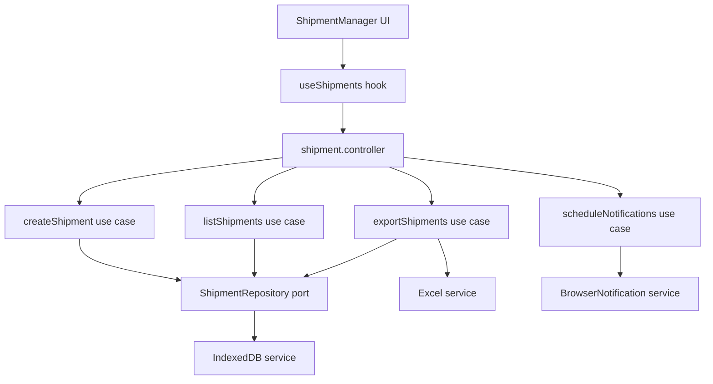

# Design Document: Shipment Management

## Overview

The Shipment Management feature adds a browser-local shipment tracking module to InsScan. It allows PPJK and freight forwarder staff to create, view, edit, and terminate shipment records entirely within the browser using IndexedDB — no backend required.

Key characteristics:
- **Storage**: IndexedDB only (browser-local, single-user)
- **Record cap**: 500 total records; export clears all records
- **Immutable fields**: shipment number and B/L number cannot be changed after creation
- **Notifications**: automated browser notifications at H-1 (one working day before ETA or custom date), checked every 3 hours
- **Export**: SheetJS (xlsx) generates a timestamped `.xlsx` file; on success all records are deleted
- **UI**: Next.js 14 App Router, React 18, Tailwind CSS, DaisyUI — consistent with existing InsScan design system

The feature follows the same Clean Architecture already established in the codebase.

---

## Architecture

The feature maps cleanly onto the existing four-layer architecture:

```
Presentation (React components)
        ↓
Adapters (controllers / presenters)
        ↓
Core (entities / use-cases / ports)
        ↓
Infrastructure (IndexedDB service, Excel service, Notification service)
```

### New files to create

```
app/
├── core/
│   ├── entities/
│   │   └── shipment.js                          # Shipment entity + validation helpers
│   ├── ports/
│   │   ├── shipment-repository.port.js          # CRUD + terminate contract
│   │   └── notification-service.port.js         # Notification scheduling contract
│   └── use-cases/
│       ├── create-shipment.js
│       ├── edit-shipment.js
│       ├── terminate-shipment.js
│       ├── list-shipments.js
│       ├── export-shipments.js
│       └── schedule-notifications.js
├── adapters/
│   ├── controllers/
│   │   └── shipment.controller.js
│   └── presenters/
│       └── shipment.presenter.js
├── infrastructure/
│   └── services/
│       ├── indexeddb.service.js                 # IndexedDB wrapper
│       └── browser-notification.service.js      # Notification + interval logic
└── presentation/
    ├── components/
    │   └── features/
    │       ├── ShipmentManager.jsx              # Root feature component
    │       ├── ShipmentTable.jsx                # Table + search + sort
    │       ├── ShipmentForm.jsx                 # Create / edit form
    │       └── ShipmentExportButton.jsx         # Export + confirmation
    └── hooks/
        └── useShipments.js                      # State + controller bridge
app/
└── shipments/
    └── page.jsx                                 # Next.js route
```

---

## Components and Interfaces

### Core Ports

#### `shipment-repository.port.js`

```js
/**
 * @typedef {Object} ShipmentRepository
 * @property {(shipment: Shipment) => Promise<Shipment>} create
 * @property {(id: number, updates: Partial<Shipment>) => Promise<Shipment>} update
 * @property {(id: number) => Promise<void>} terminate
 * @property {(id: number) => Promise<Shipment|null>} findById
 * @property {(query?: string) => Promise<Shipment[]>} listActive  // sorted by ETA asc
 * @property {() => Promise<number>} countActive
 * @property {() => Promise<Shipment[]>} listAll                   // for export
 * @property {() => Promise<void>} deleteAll                       // called after export
 */
```

#### `notification-service.port.js`

```js
/**
 * @typedef {Object} NotificationServicePort
 * @property {() => Promise<boolean>} requestPermission
 * @property {(shipment: Shipment) => void} scheduleForShipment
 * @property {() => void} startPolling   // checks every 3 hours
 * @property {() => void} stopPolling
 */
```

### Use Cases

| Use Case | Input | Output | Side Effects |
|---|---|---|---|
| `createShipment` | `ShipmentInput` | `Shipment` | persists to IndexedDB, increments counter |
| `editShipment` | `id`, `ShipmentUpdates` | `Shipment` | updates IndexedDB record |
| `terminateShipment` | `id` | `void` | marks terminated, decrements counter |
| `listShipments` | `query?` | `Shipment[]` | none |
| `exportShipments` | — | `void` | generates xlsx, deletes all records |
| `scheduleNotifications` | — | `void` | starts 3-hour polling loop |

### Adapters

**`shipment.controller.js`** — factory function that wires use cases together and exposes a single controller object consumed by the React hook.

**`shipment.presenter.js`** — maps `Shipment` entity to a flat view model safe for rendering (formats dates, resolves display labels).

### Presentation

**`useShipments.js`** — custom hook that:
- holds `shipments`, `count`, `loading`, `error` state
- calls controller methods
- triggers re-renders on mutations

**`ShipmentManager.jsx`** — top-level feature component; renders table, record counter badge, and action buttons.

**`ShipmentTable.jsx`** — renders sorted/filtered list; search input bound to `query` state.

**`ShipmentForm.jsx`** — modal/drawer form for create and edit; immutable fields rendered as `<input readOnly>` in edit mode.

**`ShipmentExportButton.jsx`** — button + DaisyUI confirmation modal; calls `exportShipments` use case.

---

## Data Models

### Shipment Entity

```js
/**
 * Creates a Shipment entity
 * @param {Object} params
 * @param {number|null}  params.id                    - Auto-assigned by IndexedDB
 * @param {string}       params.shipmentNumber        - Required, unique, immutable
 * @param {string}       params.blNumber              - Required, unique, immutable
 * @param {string}       params.shipperName           - Required
 * @param {string}       params.consigneeName         - Required
 * @param {string|null}  params.vesselName
 * @param {string|null}  params.voyage
 * @param {string|null}  params.portOfLoading
 * @param {string|null}  params.portOfDischarge
 * @param {string|null}  params.eta                   - ISO 8601 date string
 * @param {string|null}  params.customNotificationDate - ISO 8601 date string
 * @param {string|null}  params.alias
 * @param {string|null}  params.notes
 * @param {'active'|'terminated'} params.status
 * @param {string}       params.createdAt             - ISO 8601 timestamp
 * @param {string}       params.updatedAt             - ISO 8601 timestamp
 */
export function createShipment({ ... }) { ... }
```

### IndexedDB Schema

- **Database name**: `shipment_management_db`
- **Version**: `1`
- **Object store**: `shipments` (keyPath: `id`, autoIncrement: true)

| Index name | Key path | Unique |
|---|---|---|
| `shipment_number` | `shipmentNumber` | true |
| `bl_number` | `blNumber` | true |
| `eta` | `eta` | false |
| `alias` | `alias` | false |
| `custom_notification_date` | `customNotificationDate` | false |
| `status` | `status` | false |

### View Model (presenter output)

```js
{
  id: number,
  shipmentNumber: string,
  blNumber: string,
  shipperName: string,
  consigneeName: string,
  vesselName: string,
  voyage: string,
  portOfLoading: string,
  portOfDischarge: string,
  etaDisplay: string,          // formatted locale date or "—"
  customDateDisplay: string,   // formatted locale date or "—"
  alias: string,
  notes: string,
  status: 'active' | 'terminated',
  isNotificationDue: boolean,
}
```

### Excel Export Row

Each row maps directly to the shipment fields with human-readable column headers:

| Column Header | Field |
|---|---|
| Shipment Number | shipmentNumber |
| B/L Number | blNumber |
| Shipper Name | shipperName |
| Consignee Name | consigneeName |
| Vessel Name | vesselName |
| Voyage | voyage |
| Port of Loading | portOfLoading |
| Port of Discharge | portOfDischarge |
| ETA | eta |
| Custom Notification Date | customNotificationDate |
| Alias | alias |
| Notes | notes |
| Status | status |
| Created At | createdAt |

---

## Notification Logic

### H-1 Calculation

H-1 means one **working day** before the target date. A working day excludes Saturdays, Sundays, and Indonesian public holidays.

```
function getHMinusOne(targetDate: Date): Date {
  let candidate = subDays(targetDate, 1)
  while (isWeekend(candidate) || isPublicHoliday(candidate)) {
    candidate = subDays(candidate, 1)
  }
  return candidate
}
```

For the initial implementation, public holidays will be a hardcoded list for the current year (Indonesian national holidays). This list lives in `app/core/entities/public-holidays.js` and can be updated annually.

### Polling

`scheduleNotifications` starts a `setInterval` at 3-hour intervals. On each tick:
1. Fetch all active shipments
2. For each shipment, compute H-1 for ETA and/or custom date
3. If today matches H-1 and notification has not been sent today, fire notification
4. Track sent notifications in `sessionStorage` (key: `notified_<id>_<date>`) to avoid duplicates within a session

### Permission Fallback

If `Notification.permission === 'denied'` or the API is unavailable, the service falls back to an in-app toast/alert rendered via a React context (`NotificationContext`).

---

## Mermaid Diagram — Data Flow



---


## Correctness Properties

*A property is a characteristic or behavior that should hold true across all valid executions of a system — essentially, a formal statement about what the system should do. Properties serve as the bridge between human-readable specifications and machine-verifiable correctness guarantees.*

**Property reflection before writing:**

- 1.3 (create increments count) and 5.4 (terminate decrements count) are complementary invariants — kept separate because they test opposite directions.
- 1.6 and 9.1 are identical (shipment number uniqueness) — merged into one property.
- 1.7 and 9.2 are identical (B/L number uniqueness) — merged into one property.
- 3.3 and 3.4 are the same search property (inclusion + exclusion) — combined into one comprehensive property.
- 6.3 and 6.4 both concern export output structure — combined into one export completeness property.
- 6.6 and 6.7 both concern post-export state — combined into one property.
- 7.1 and 7.2 both test H-1 calculation — combined into one property covering any target date.
- 4.4 (edit round-trip) subsumes 4.1 (general edit capability) — kept 4.4 only.

---

### Property 1: Shipment creation round-trip

*For any* valid shipment input, after calling `createShipment`, a subsequent `findById` with the returned id should return a record whose mutable fields are equal to the input values.

**Validates: Requirements 1.1, 1.2**

---

### Property 2: Create increments active count

*For any* initial state with N active records (where N < 500), after a successful `createShipment`, `countActive` should return N + 1.

**Validates: Requirements 1.3, 2.1**

---

### Property 3: Record limit blocks creation

*For any* state where `countActive` equals or exceeds 500, calling `createShipment` should throw or return an error indicating the limit has been reached, and `countActive` should remain unchanged.

**Validates: Requirements 1.4, 2.3**

---

### Property 4: Required field validation rejects incomplete inputs

*For any* shipment input that is missing at least one required field (shipment number, B/L number, shipper name, or consignee name), `createShipment` should reject with a validation error and no record should be persisted.

**Validates: Requirements 1.5, 9.4**

---

### Property 5: Shipment number and B/L number uniqueness

*For any* existing set of active records, attempting to create a new record with a `shipmentNumber` or `blNumber` that already exists in the set should fail with a uniqueness error, and the total record count should remain unchanged.

**Validates: Requirements 1.6, 1.7, 9.1, 9.2**

---

### Property 6: List is sorted by ETA ascending

*For any* collection of active shipments with varying ETA values (including nulls), `listShipments` should return them in ascending ETA order, with null ETAs sorted last.

**Validates: Requirements 3.2**

---

### Property 7: Search returns only matching records

*For any* non-empty search query and any backing dataset, every record returned by `listShipments(query)` should contain the query string (case-insensitive) in at least one of: `blNumber`, `shipperName`, `consigneeName`, or `alias`. Conversely, no record that matches the query in any of those fields should be absent from the results.

**Validates: Requirements 3.3, 3.4**

---

### Property 8: Immutable fields cannot be changed via edit

*For any* existing shipment and any update object that includes a new `shipmentNumber` or `blNumber`, after calling `editShipment`, the stored record's `shipmentNumber` and `blNumber` should remain equal to their original values.

**Validates: Requirements 4.2**

---

### Property 9: Edit round-trip persists mutable changes

*For any* existing shipment and any valid update to mutable fields (e.g., `vesselName`, `eta`, `alias`, `notes`), after `editShipment`, `findById` should return a record reflecting the updated values while all other fields remain unchanged.

**Validates: Requirements 4.4**

---

### Property 10: Terminated record is excluded from active list

*For any* active shipment, after calling `terminateShipment`, `listShipments` (active records only) should not contain that record.

**Validates: Requirements 5.3**

---

### Property 11: Terminate decrements active count

*For any* state with N active records (N > 0), after a successful `terminateShipment`, `countActive` should return N - 1.

**Validates: Requirements 5.4**

---

### Property 12: Export output is complete and well-structured

*For any* collection of active shipments, the data array produced by the export use case should contain exactly as many rows as there are active records, and every row should include all required column headers (Shipment Number, B/L Number, Shipper Name, Consignee Name, Vessel Name, Voyage, Port of Loading, Port of Discharge, ETA, Custom Notification Date, Alias, Notes, Status, Created At).

**Validates: Requirements 6.3, 6.4**

---

### Property 13: Successful export clears all records

*For any* non-empty set of records, after a successful export, `listAll` should return an empty array and `countActive` should return 0.

**Validates: Requirements 6.6, 6.7**

---

### Property 14: Failed export leaves records intact

*For any* set of records, if the Excel generation step throws an error, `countActive` after the failed export attempt should equal `countActive` before the attempt.

**Validates: Requirements 6.8**

---

### Property 15: H-1 is always a working day before the target date

*For any* target date (ETA or custom notification date), `getHMinusOne(targetDate)` should return a date that:
1. Is strictly before `targetDate`
2. Is not a Saturday or Sunday
3. Is not a public holiday
4. Has no other working day between it and `targetDate`

**Validates: Requirements 7.1, 7.2**

---

### Property 16: Notification due check is correct

*For any* shipment where `getHMinusOne(eta)` equals today's date, `isNotificationDue(shipment, today)` should return `true`. For any shipment where `getHMinusOne(eta)` does not equal today, it should return `false`.

**Validates: Requirements 7.3**

---

### Property 17: Date validation correctly classifies inputs

*For any* valid ISO 8601 date string, `isValidDate` should return `true`. For any string that is not a valid date (empty string, random text, malformed date), `isValidDate` should return `false`.

**Validates: Requirements 9.3, 9.5**

---

## Error Handling

| Scenario | Handling |
|---|---|
| Required field missing | Validation error returned from use case; UI shows inline field error |
| Duplicate shipment number or B/L number | Uniqueness error from use case; UI shows specific field error |
| Record limit reached (≥ 500) | Use case rejects with limit error; UI disables create button and shows banner |
| IndexedDB unavailable / quota exceeded | Infrastructure service throws; controller catches and returns user-friendly message |
| Excel export failure | Use case catches error, does NOT call `deleteAll`, returns error to UI |
| Browser notifications denied | Notification service falls back to in-app toast via `NotificationContext` |
| Invalid date input | Validation helper rejects; UI shows date format hint |

All use cases follow a consistent error shape:

```js
{ ok: false, error: { code: string, message: string } }
// or on success:
{ ok: true, data: T }
```

This allows the controller and hook to handle errors uniformly without try/catch at the component level.

---

## Testing Strategy

### Unit Tests (example-based)

Focus on specific scenarios and edge cases:

- `createShipment` with all required fields → success
- `createShipment` with missing required field → validation error
- `createShipment` when count === 500 → limit error
- `editShipment` attempting to change `shipmentNumber` → immutable field preserved
- `terminateShipment` on already-terminated record → error
- `exportShipments` when Excel generation throws → records unchanged
- `getHMinusOne` on a Monday → returns previous Friday
- `getHMinusOne` on a date after a public holiday → skips holiday
- `isValidDate` with empty string → false
- `isValidDate` with `"2025-01-15"` → true
- Notification fallback when `Notification.permission === 'denied'`

### Property-Based Tests

Use **fast-check** (JavaScript PBT library) with a minimum of **100 iterations per property**.

Each test is tagged with:
```
// Feature: shipment-management, Property N: <property text>
```

Properties to implement as property-based tests:

| Property | fast-check Arbitraries |
|---|---|
| P1: Creation round-trip | `fc.record({ shipmentNumber: fc.string(), blNumber: fc.string(), ... })` |
| P2: Create increments count | `fc.integer({ min: 0, max: 499 })` for initial count |
| P3: Limit blocks creation | `fc.integer({ min: 500, max: 600 })` for count |
| P4: Required field validation | `fc.record(...)` with one required field set to `""` or `null` |
| P5: Uniqueness enforcement | `fc.array(fc.record(...))` with injected duplicate |
| P6: Sort by ETA ascending | `fc.array(fc.record({ eta: fc.option(fc.date()) }))` |
| P7: Search returns matching records | `fc.string()` query + `fc.array(fc.record(...))` dataset |
| P8: Immutable fields preserved on edit | `fc.record(...)` shipment + `fc.record(...)` update with new immutable values |
| P9: Edit round-trip | `fc.record(...)` shipment + valid mutable update |
| P10: Terminated excluded from active list | `fc.record(...)` active shipment |
| P11: Terminate decrements count | `fc.integer({ min: 1, max: 500 })` for initial count |
| P12: Export completeness | `fc.array(fc.record(...), { minLength: 1 })` |
| P13: Export clears records | `fc.array(fc.record(...), { minLength: 1 })` |
| P14: Failed export preserves records | `fc.array(fc.record(...), { minLength: 1 })` |
| P15: H-1 is working day before target | `fc.date({ min: new Date('2020-01-01'), max: new Date('2030-12-31') })` |
| P16: Notification due check | `fc.date()` for today + shipment with matching/non-matching H-1 |
| P17: Date validation | `fc.string()` for invalid; `fc.date().map(d => d.toISOString().slice(0,10))` for valid |

### Integration Tests

- IndexedDB service: open DB, create record, read back, update, terminate, list — using a real in-browser IndexedDB (via `fake-indexeddb` in Jest/Vitest)
- Export service: generate xlsx from sample data, parse back with SheetJS, verify row count and headers
- Notification service: verify `setInterval` is called with 3-hour delay; verify `requestPermission` is called on init

### Component Tests

- `ShipmentForm` renders read-only fields for `shipmentNumber` and `blNumber` in edit mode
- `ShipmentTable` renders sorted list; search input filters visible rows
- `ShipmentExportButton` shows confirmation modal before triggering export
- Record counter badge shows correct `N/500` format
